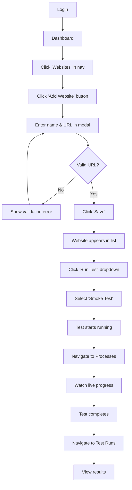
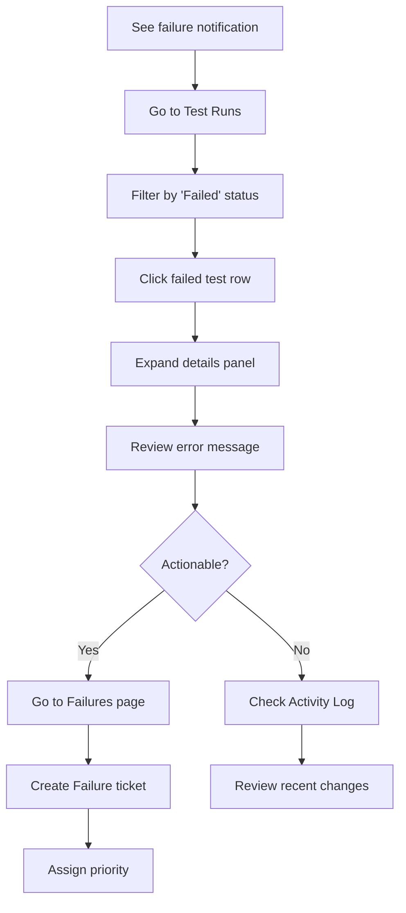
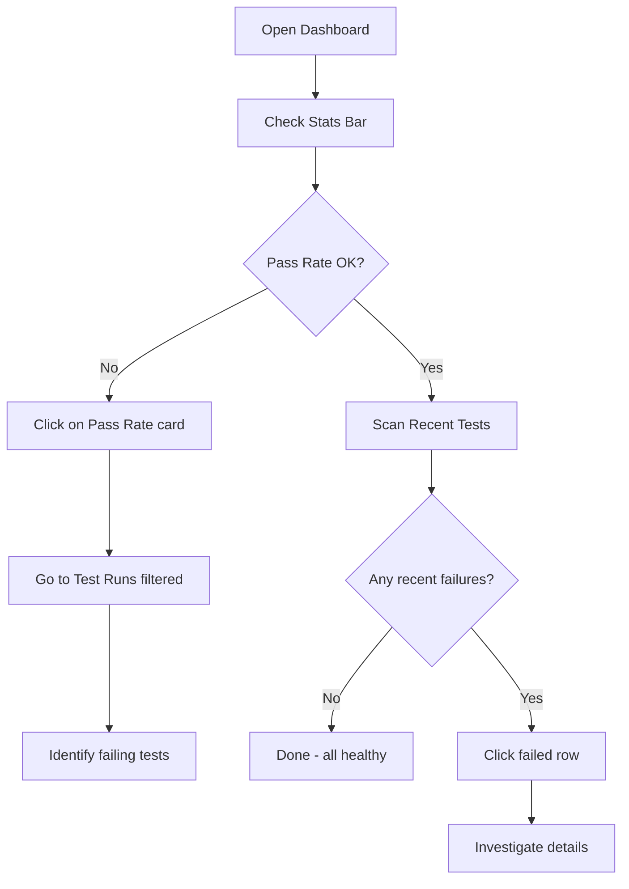

# QA Testing Dashboard - UX Design Specification

**Version:** 1.0  
**Purpose:** BMAD UX Reference for User Experience Design  
**Last Updated:** January 2026

---

## 1. USER UNDERSTANDING

### 1.1 Primary Personas

#### Persona 1: Agency Owner "Alex"
- **Role:** Runs a digital agency with 10+ client websites
- **Goals:** Monitor all client sites at a glance, catch issues before clients do
- **Pain Points:** Juggling multiple tools, no unified view, reactive firefighting
- **Usage Pattern:** Checks dashboard 2-3x daily, runs tests after deployments
- **Technical Level:** Medium - understands web basics, not a developer

#### Persona 2: Developer "Sam"
- **Role:** Full-stack developer responsible for client websites
- **Goals:** Quick smoke tests after deployments, performance optimization
- **Pain Points:** Manual testing is slow, no automated regression catching
- **Usage Pattern:** Runs tests immediately after code pushes
- **Technical Level:** High - wants detailed technical metrics

#### Persona 3: Marketing Manager "Jordan"
- **Role:** Manages analytics and tracking for campaigns
- **Goals:** Ensure pixels fire correctly, validate tracking setup
- **Pain Points:** Broken pixels = lost revenue, hard to audit implementations
- **Usage Pattern:** Weekly pixel audits, checks before campaign launches
- **Technical Level:** Low-Medium - knows what to look for, not how it works

### 1.2 User Jobs-to-be-Done

| Job | Importance | Frequency |
|-----|------------|-----------|
| "I need to know if my client's site is working" | Critical | Daily |
| "I need to run a quick test after deployment" | High | Multiple times/day |
| "I need to see what's failing across all sites" | High | Daily |
| "I need performance metrics for client reports" | Medium | Weekly |
| "I need to verify tracking pixels are firing" | Medium | Weekly/Campaign launches |
| "I need to prove we're maintaining site quality" | Medium | Monthly |

---

## 2. INFORMATION ARCHITECTURE

### 2.1 Site Map

```
QA Testing Dashboard
│
├── 🏠 Dashboard (Home)
│   ├── Stats Overview
│   ├── Recent Test Runs
│   └── Quick Actions
│
├── 🌐 Websites
│   ├── Website List
│   ├── Add Website Modal
│   ├── Website Details (future)
│   └── Run Test Actions
│
├── 📊 Test Runs
│   ├── Filter Tabs (by test type)
│   ├── Test Run List
│   └── Test Run Details (expandable)
│
├── ❌ Failures
│   ├── Filter Bar
│   ├── Failure List
│   ├── Create Failure Modal
│   └── Failure Details
│
├── 📝 Activity Log
│   ├── Filter Controls
│   └── Activity Feed
│
├── ⚙️ Processes
│   ├── Status Summary
│   ├── Filter Tabs
│   └── Process Cards
│
├── 💚 System Status
│   ├── Service Health Cards
│   └── Service Details Table
│
└── ❓ Help
    ├── Test Types Guide
    ├── Service Architecture
    ├── How It Works
    └── Quick Start
```

### 2.2 Navigation Priority

**Primary Actions (always visible):**
1. Dashboard - Overview/home
2. Websites - Main workspace
3. Test Runs - Results exploration

**Secondary Actions (monitoring):**
4. Failures - Issue tracking
5. Activity Log - Audit trail
6. Processes - Live monitoring

**Utility:**
7. System Status - Infrastructure health
8. Help - Documentation

---

## 3. USER FLOWS

### 3.1 Flow: Add Website & Run First Test



### 3.2 Flow: Investigate a Failure



### 3.3 Flow: Daily Health Check



---

## 4. WIREFRAME DESCRIPTIONS

### 4.1 Dashboard Page

```
┌─────────────────────────────────────────────────────────────┐
│ [Logo] QA Testing Dashboard                    [admin ▼] [Logout]│
├──────────┬──────────────────────────────────────────────────┤
│          │                                                  │
│ Dashboard│  QA Testing Dashboard                            │
│          │  Automated website quality assurance...           │
│ Websites │                                                  │
│          │  ┌──────────┬──────────┬──────────┬──────────┐  │
│ Test Runs│  │ Total    │ Pass Rate│ Total    │ System   │  │
│          │  │ Websites │ (7d)     │ Tests    │ Health   │  │
│ Failures │  │    5     │   0%     │   —      │  Idle    │  │
│          │  └──────────┴──────────┴──────────┴──────────┘  │
│ Activity │                                                  │
│          │  Recent Test Runs                                │
│ Processes│  ┌─────────────────────────────────────────────┐│
│          │  │ Website      │ Type  │ Status │ Time │ Date ││
│ Status   │  ├─────────────────────────────────────────────┤│
│          │  │ Mercan LP    │ Smoke │ [Fail] │ 0.5s │ 12/31││
│ Help     │  │ Mercan LP    │ Smoke │ [Fail] │ 0.5s │ 12/30││
│          │  │ test         │ Visual│ [Pass] │ 8.5s │ 12/29││
│          │  └─────────────────────────────────────────────┘│
│          │                                                  │
│          │  Quick Actions                                   │
│          │  ┌─────────────┬─────────────┬─────────────┐    │
│          │  │ Add Website │ Run Tests   │ View All    │    │
│          │  │ Register... │ Execute...  │ Browse...   │    │
│          │  └─────────────┴─────────────┴─────────────┘    │
│          │                                                  │
└──────────┴──────────────────────────────────────────────────┘
```

### 4.2 Websites Page

```
┌──────────────────────────────────────────────────────────────┐
│ Websites                                    [+ Add Website]  │
├──────────────────────────────────────────────────────────────┤
│                                                              │
│  ┌───────────────────────────────────────────────────────┐  │
│  │ Website          │ Status │ Last   │ Tested │ # │ Actions│
│  ├───────────────────────────────────────────────────────┤  │
│  │ Mercan Portugal  │ Active │ [Fail] │ 12/31  │ 5 │ [Run ▼]│
│  │ goldenvisas...   │        │        │        │   │        │
│  ├───────────────────────────────────────────────────────┤  │
│  │ test             │ Active │ [Pass] │ 12/29  │ 3 │ [Run ▼]│
│  │ manelmhadhbi.com │        │        │        │   │        │
│  ├───────────────────────────────────────────────────────┤  │
│  │ Variable         │ Active │ [Pass] │ 12/29  │ 7 │ [Run ▼]│
│  │ variablelift.com │        │        │        │   │        │
│  └───────────────────────────────────────────────────────┘  │
│                                                              │
└──────────────────────────────────────────────────────────────┘

[Run Test Dropdown]
┌─────────────────┐
│ 💨 Smoke Test   │
│ ⚡ Performance  │
│ 📊 Load Test    │
│ ♿ Accessibility │
│ 🔒 Security     │
│ 📈 SEO Audit    │
│ 👁️ Visual       │
│ 🔍 Pixel Audit  │
├─────────────────┤
│ 🚀 Run All      │
└─────────────────┘
```

### 4.3 Test Runs Page

```
┌──────────────────────────────────────────────────────────────┐
│ Test Runs                                       [🔄 Refresh] │
├──────────────────────────────────────────────────────────────┤
│                                                              │
│  [All (41)] [Smoke (9)] [Perf (4)] [Load (4)] [Access (6)]  │
│  [Security (6)] [SEO (3)] [Visual (5)] [Pixel (4)]          │
│                                                              │
│  ┌───────────────────────────────────────────────────────┐  │
│  │ Website          │ Test Type │ Status │ Tests │ Time  │  │
│  ├───────────────────────────────────────────────────────┤  │
│  │ Mercan LP        │ 💨 Smoke  │ [Fail] │ 2/4   │ 0.52s │  │
│  │                  │           │        │(2 fail)│       │  │
│  ├───────────────────────────────────────────────────────┤  │
│  │ test             │ 👁️ Visual │ [Pass] │ 3/3   │ 8.50s │  │
│  ├───────────────────────────────────────────────────────┤  │
│  │ Variable         │ 🔒 Secur. │ [Pass] │ 8/9   │ 3.95s │  │
│  │                  │           │        │(1 fail)│       │  │
│  └───────────────────────────────────────────────────────┘  │
│                                                              │
│  ◀ Previous                                        Next ▶   │
│                                                              │
└──────────────────────────────────────────────────────────────┘
```

### 4.4 Process Monitor

```
┌──────────────────────────────────────────────────────────────┐
│ Process Monitor                                              │
│ Real-time tracking of test executions                        │
├──────────────────────────────────────────────────────────────┤
│                                                              │
│  ┌──────────┬──────────┬──────────┬──────────┐              │
│  │ 🔄 0     │ ✅ 0     │ ❌ 57    │ 📈 57    │              │
│  │ Running  │ Complete │ Failed   │ Total    │              │
│  └──────────┴──────────┴──────────┴──────────┘              │
│                                                              │
│  [All] [Running (0)] [Completed] [Failed]                    │
│                                                              │
│  ┌─────────────────────────────────────────────────────┐    │
│  │ 💨 smoke test                              [failed] │    │
│  │ Website: Mercan Portugal LP                         │    │
│  │ URL: goldenvisas.mercan.com/portugal               │    │
│  │ Started: Dec 31, 04:54 AM                          │    │
│  │ Duration: 12m 54s                                   │    │
│  │ ⚠️ Error: Process timed out after 10.0 minutes     │    │
│  └─────────────────────────────────────────────────────┘    │
│                                                              │
└──────────────────────────────────────────────────────────────┘
```

---

## 5. COMPONENT ARCHITECTURE

### 5.1 Layout Components

```
<AppLayout>
├── <Sidebar>
│   ├── <Logo />
│   ├── <NavItem /> (x8)
│   └── <UserMenu />
├── <Header>
│   └── <UserDropdown />
└── <MainContent>
    └── {children}
```

### 5.2 Shared Components

| Component | Props | Usage |
|-----------|-------|-------|
| `<StatsCard>` | title, value, icon, trend | Dashboard stats |
| `<StatusBadge>` | status: 'pass' \| 'fail' \| 'running' | Status indicators |
| `<DataTable>` | columns, data, onRowClick | All tables |
| `<FilterTabs>` | tabs, activeTab, onChange | Test runs filtering |
| `<Modal>` | isOpen, onClose, title | Add website, details |
| `<Dropdown>` | options, onSelect | Run test menu |
| `<EmptyState>` | icon, title, description | No data states |
| `<LoadingSpinner>` | size | Loading indicators |
| `<Toast>` | type, message | Notifications |

### 5.3 Page-Specific Components

**Dashboard:**
- `<RecentTestsTable>`
- `<QuickActionsGrid>`

**Websites:**
- `<WebsiteRow>`
- `<AddWebsiteModal>`
- `<RunTestDropdown>`

**Test Runs:**
- `<TestRunRow>`
- `<TestRunDetails>` (expandable)
- `<TestTypeFilter>`

**Processes:**
- `<ProcessCard>`
- `<ProcessStatusBar>`

---

## 6. INTERACTION PATTERNS

### 6.1 Table Interactions

| Action | Behavior |
|--------|----------|
| Row click | Expand details OR navigate |
| Sort column | Click header to sort |
| Filter | Tabs or dropdown |
| Pagination | Next/Previous buttons |
| Refresh | Manual refresh button |

### 6.2 Form Interactions

| Field | Validation | Feedback |
|-------|------------|----------|
| Website name | Required, min 2 chars | Inline error |
| Website URL | Required, valid URL format | Inline error |
| Form submit | Disable button while saving | Loading spinner |
| Success | Close modal, show toast | Green toast |
| Error | Keep modal open, show error | Red toast |

### 6.3 Test Execution Flow

1. User clicks "Run Test" → Dropdown appears
2. User selects test type → API call initiated
3. Button shows loading state → Spinner replaces text
4. Toast notification → "Test started for [website]"
5. Auto-redirect (optional) → Navigate to Processes page
6. Live updates → Process card shows progress
7. Completion → Toast notification with result

---

## 7. RESPONSIVE BEHAVIOR

### 7.1 Breakpoint Strategy

| Breakpoint | Sidebar | Table | Cards |
|------------|---------|-------|-------|
| Mobile (<768px) | Hidden/Hamburger | Scroll horizontal | Stack vertical |
| Tablet (768-1024px) | Icons only | Full width | 2 columns |
| Desktop (>1024px) | Full sidebar | Contained | 4 columns |

### 7.2 Mobile Adaptations

**Dashboard:**
- Stats cards: 2x2 grid → Single column
- Recent tests: Condensed view with fewer columns

**Websites:**
- Table → Card list
- Actions: Swipe or long-press

**Test Runs:**
- Filter tabs: Horizontal scroll
- Details: Full-screen modal

---

## 8. EMPTY & ERROR STATES

### 8.1 Empty States

**No Websites:**
```
┌─────────────────────────────────┐
│         🌐                      │
│    No Websites Yet              │
│                                 │
│  Add your first website to      │
│  start testing.                 │
│                                 │
│       [+ Add Website]           │
└─────────────────────────────────┘
```

**No Test Runs:**
```
┌─────────────────────────────────┐
│         📊                      │
│    No Test Runs Found           │
│                                 │
│  Run your first test from the   │
│  Websites page.                 │
│                                 │
│       [Go to Websites]          │
└─────────────────────────────────┘
```

**No Failures:**
```
┌─────────────────────────────────┐
│         ✅                      │
│    All Tests Passing!           │
│                                 │
│  No failures found. Great job!  │
│                                 │
└─────────────────────────────────┘
```

### 8.2 Error States

**API Error:**
- Red toast notification
- "Failed to load data. Please try again."
- Retry button

**Test API Down:**
- Warning banner at top of page
- "Test API is currently unavailable. Some features may not work."
- System Status link

**Invalid URL:**
- Inline form error
- "Please enter a valid URL including http:// or https://"

---

## 9. ACCESSIBILITY REQUIREMENTS

### 9.1 Keyboard Navigation

- Tab through all interactive elements
- Enter/Space to activate buttons
- Escape to close modals
- Arrow keys in dropdowns
- Focus visible indicators

### 9.2 Screen Reader Support

- Semantic HTML structure
- ARIA labels on icons/buttons
- Live regions for toast notifications
- Table headers properly associated

### 9.3 Color Accessibility

- Don't rely on color alone for status
- Use icons + color for pass/fail
- Minimum 4.5:1 contrast ratio
- Reduced motion preference support

---

## 10. SUCCESS METRICS

### 10.1 Usability KPIs

| Metric | Target |
|--------|--------|
| Time to add first website | < 30 seconds |
| Time to run first test | < 1 minute |
| Task completion rate | > 95% |
| Error rate | < 2% |

### 10.2 Engagement KPIs

| Metric | Target |
|--------|--------|
| Daily active users | Track baseline |
| Tests run per user/week | > 10 |
| Return rate (7-day) | > 50% |
| Feature adoption (all test types) | > 30% |

---

**UX SPECIFICATION COMPLETE** ✓

This document provides the user experience blueprint for BMAD development.
